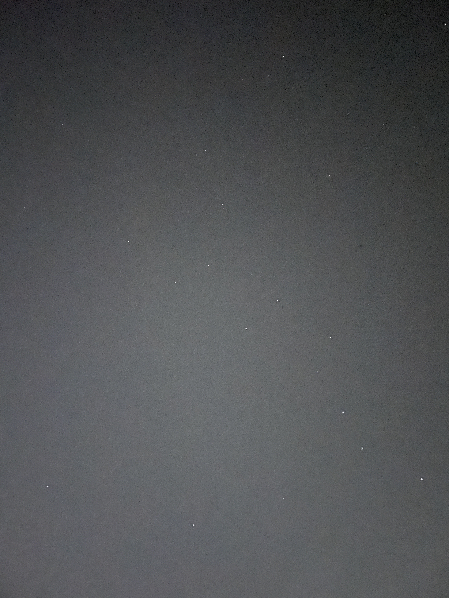
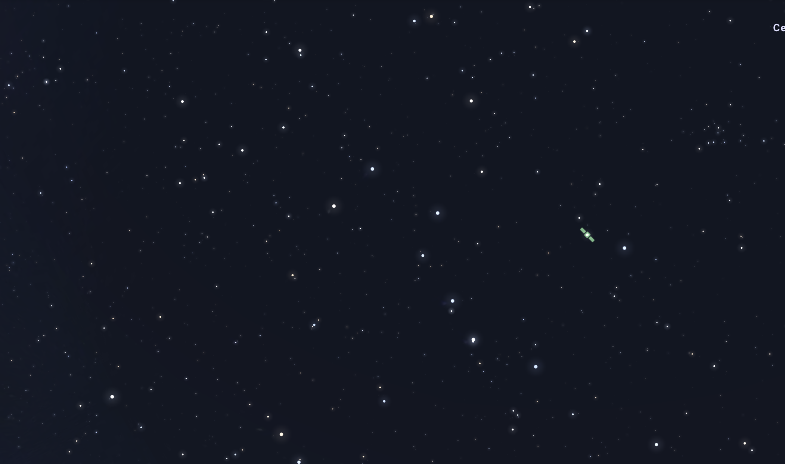
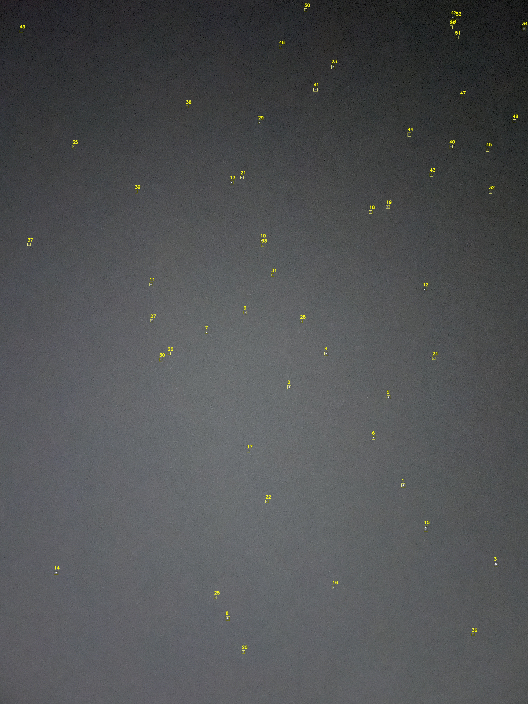
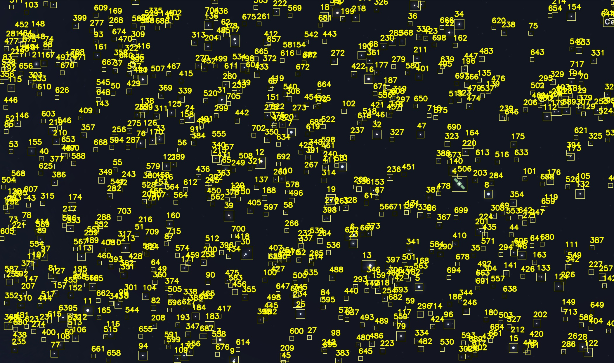
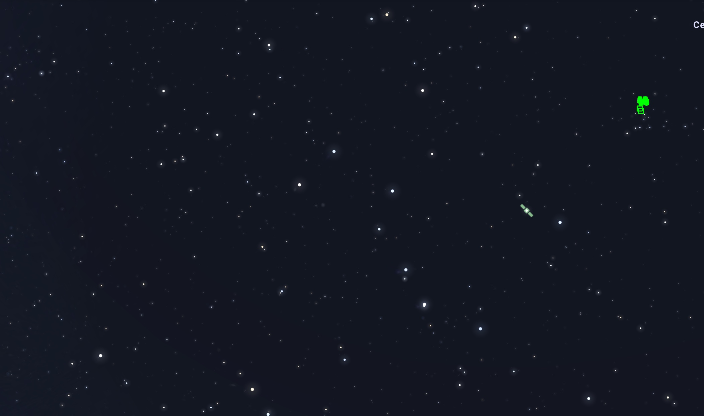

# Star Tracker Project

**Authors**  
Roni Michaeli & Neta Cohen  
Ariel University, Introduction to Space Engineering, Assignment 1: Developing a Star Tracker Algorithm

---

## 📋 Table of Contents

- [Overview](#overview)  
- [Algorithms](#algorithms)  
  - [Star Detection](#star-detection)  
  - [Star Matching](#star-matching)  
- [Installation](#installation)  
  - [macOS](#macos)  
  - [Windows](#windows)  
- [Usage](#usage)  
  - [Before Processing](#before-processing)  
  - [After Detection](#after-detection)  
  - [After Matching](#after-matching)  
- [Outputs Explained](#outputs-explained)  
  - [Annotated Images](#annotated-images)  
  - [CSV Files](#csv-files)  
- [Project Structure](#project-structure)  
- [License & Contact](#license--contact)  

---

## 📝 Overview

This project implements a simple and efficient **star tracker**:

1. **Detect stars** in an image and record their `(x, y)` position, radius `r`, and brightness `b`.  
2. **Match** a small “template” image (10–20 stars) with a larger image (100+ stars) by finding the best **scale + rotation + translation** that lines up as many stars as possible.

We tested our code on pairs of images from Stellarium (with lens distortion + satellites) and iPhone photos.

You can see the entire process on GitHub at [roni5604/star-tracker](https://github.com/roni5604).

---

## 🔍 Algorithms

### Star Detection

1. **Grayscale & Blur**  
   Convert the image to grayscale and apply a small Gaussian blur to reduce noise.

2. **Background Removal (Top‑Hat)**  
   Use a morphological “open” filter to estimate the smooth background, then subtract it from the blurred image. This highlights bright spots (stars).

3. **Threshold & Clean**  
   Apply a fixed threshold to make a binary image, then remove tiny artifacts with a small morphological open.

4. **Contour Extraction**  
   Find all bright regions (contours), filter by area (`min_area…max_area`), and compute for each:
   - **Center** `(cx, cy)`  
   - **Radius** `r = √(area/π)`  
   - **Brightness** `b` (mean pixel value inside the contour)

5. **Deduplication**  
   Sort detections by brightness and remove overlaps: if two detections are too close (relative to their size), keep only the brighter one.

6. **Output**  
   - Annotated image with rectangles + IDs  
   - CSV file `small_coords.csv` / `large_coords.csv` with columns:  
     ```
     id, x, y, r, b
     ```

### Star Matching

1. **Random Small‑Pair Sampling**  
   Shuffle all pairs of small‑image stars.

2. **Exhaustive Large‑Pair Loop**  
   For each small pair `(p1, p2)` and each large pair `(l1, l2)`:
   - Compute **scale** = `dist(l1,l2) / dist(p1,p2)`  
   - Compute **rotation** = `angle(l2–l1) − angle(p2–p1)`  
   - Compute **translation** so that `p1 → l1`

3. **Transform All Small Stars**  
   Apply `(scale, rotation, translation)` to every small‑image star `(x,y) → (xp, yp)`.

4. **Matching Criterion**  
   A transformed small star matches a large star if its distance to the nearest large star is ≤  
   ```
   tol = r_small * dist_tol_factor * scale + abs_tol
   ```
   where:
   - `dist_tol_factor` scales tolerance by star size  
   - `abs_tol` adds a fixed pixel margin  

5. **Score & Early Stop**  
   Count matched pairs. Remember the best mapping. Stop when ≥ 60% of small stars match.

---

## 🛠️ Installation

Make sure you have Python 3.7+ installed.

### macOS

```bash
# Clone repo
git clone https://github.com/roni5604/star-tracker.git
cd star-tracker

# (Optional) create virtual environment
python3 -m venv venv
source venv/bin/activate

# Install dependencies
pip install --upgrade pip
pip install opencv-python numpy
```

### Windows

```powershell
# Clone repo
git clone https://github.com/roni5604/ex1.git
cd star-tracker

# (Optional) create virtual environment
python -m venv venv
venv\Scripts\activate

# Install dependencies
pip install --upgrade pip
pip install opencv-python numpy
```

---

## ▶️ Usage

Run the main script:

```bash
python match_stars.py
```

You will see console output like:

```
✔ small.jpg: detected 54 stars
✔ large.png: detected 719 stars
✔ matched 53/54 stars (98.1%)
✔ large_matched.jpg saved
✔ matches.csv saved
```

---

## 🖼️ Before & After

### Before Processing

| Small Template | Large Image |
|:--------------:|:-----------:|
|  |  |

### After Star Detection

| small_detected.jpg | large_detected.jpg |
|:------------------:|:------------------:|
|  |  |

### After Matching

| large_matched.jpg |
|:-----------------:|
|  |

---

## 📂 Outputs Explained

### Annotated Images

- **small_detected.jpg**: rectangles + IDs around stars in `small.jpg`  
- **large_detected.jpg**: rectangles + IDs around stars in `large.png`  
- **large_matched.jpg**: only the stars that matched the small template, numbered by `small_id`

### CSV Files

- **small_coords.csv / large_coords.csv**  
  Columns:  
  ```
  id, x, y, r, b
  ```
  Example:
  ```
  1, 1393.0, 3734.0, 2.68, 154.5
  2, 1302.0, 3541.0, 4.41, 197.4
  ```

- **matches.csv**  
  Columns:
  ```
  small_id, small_x, small_y, large_id, large_x, large_y
  ```
  Example:
  ```
  1,2310.0,2779.5,617,1621.5,1201.0
  ```

---

## 📁 Project Structure

```
.
├── match_stars.py
├── small.jpg
├── large.png
├── fr1.jpg
├── fr2.jpg
├── small_detected.jpg
├── large_detected.jpg
├── large_matched.jpg
├── small_coords.csv
├── large_coords.csv
├── matches.csv
└── venv/           # optional virtual environment
```

---

## 📬 Contact & License

This project is for **Ariel University** course “Introduction to Space Engineering.”  
Feel free to open an issue on GitHub if you have questions.

**License**: MIT  
**GitHub**: [github.com/roni5604/star-tracker](https://github.com/roni5604/ex1)  
**Authors**: Roni Michaeli & Neta Cohen  
