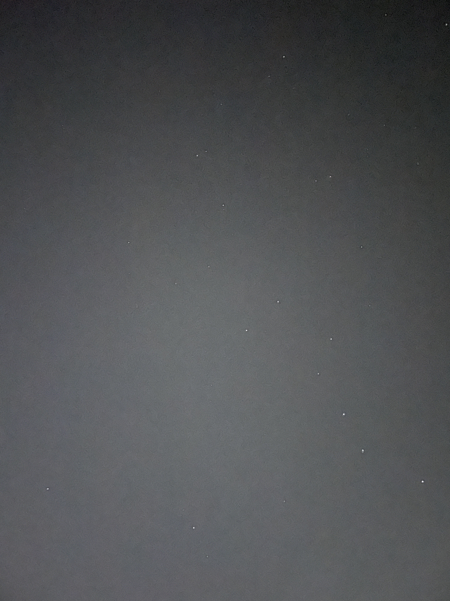
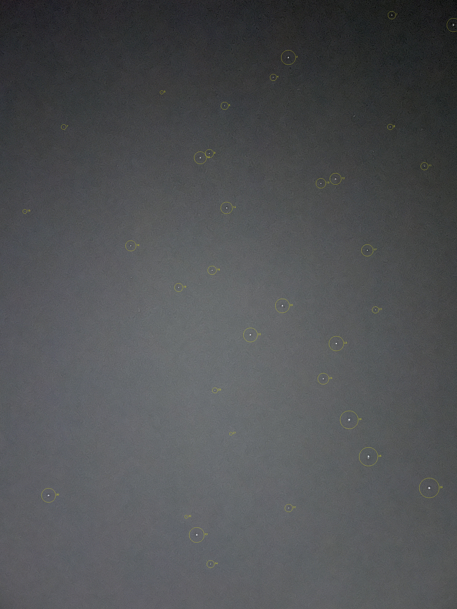
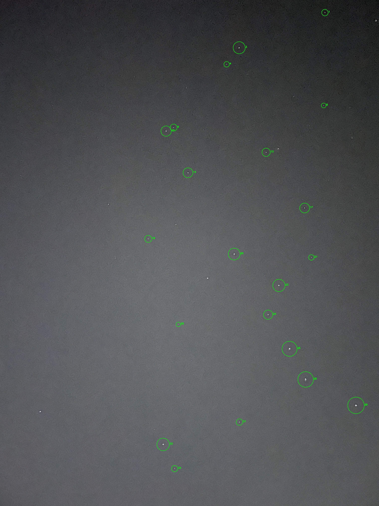
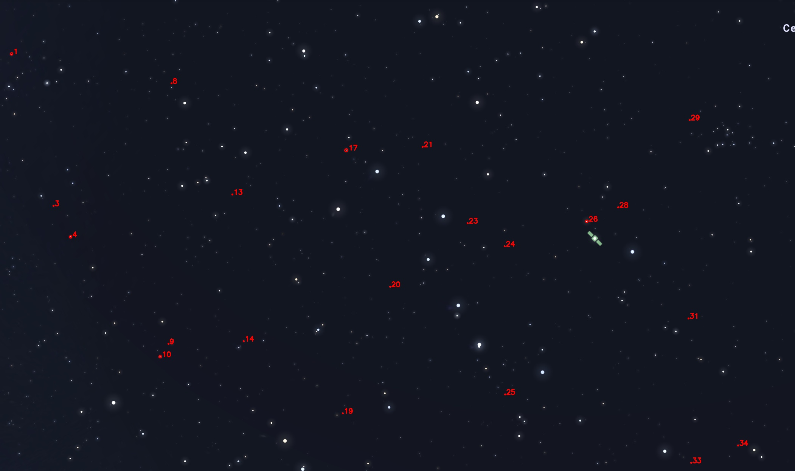

# Star Tracker Project

**Authors**  
Roni Michaeli & Neta Cohen  
Ariel University, Introduction to Space Engineering, Assignment 1: Developing a Star Tracker Algorithm

---

## 📋 Table of Contents

- [Overview](#overview)  
- [Algorithms](#algorithms)  
  - [Star Detection](#star-detection)  
  - [Star Matching](#star-matching)  
- [Installation](#installation)  
- [Usage](#usage)  
  - [Before Processing](#before-processing)  
  - [After Detection](#after-detection)  
  - [After Matching](#after-matching)  
  - [Interactive Review](#interactive-review)  
- [Outputs Explained](#outputs-explained)  
  - [Annotated Images](#annotated-images)  
  - [CSV Files](#csv-files)  
- [Project Structure](#project-structure)  
- [License & Contact](#license--contact)  

---

## 📝 Overview

This project implements a simple and efficient **star tracker**:

1. **Detect stars** in an image and record their `(x, y)` position, radius `r`, and brightness `b`.  
2. **Match** a small “template” image (10–60 stars) with a larger image (100–800+ stars) by finding the best **scale + rotation + translation** that lines up as many stars as possible.  
3. **Review** results interactively: navigate three screens—Before Matching, After Detection, After Matching—using on‑screen arrows.

All outputs (annotated images, CSVs) are written into `output/`.

---

## 🔍 Algorithms

### Star Detection

1. **Grayscale & Blur**  
   Convert to grayscale, apply Gaussian blur.  
2. **Background Removal (Top‑Hat)**  
   Morphological open to estimate background, subtract to highlight stars.  
3. **Threshold & Clean**  
   Binary threshold + morphological open to remove noise.  
4. **Contour Extraction**  
   Filter contours by area; compute center `(cx,cy)`, radius `r = √(area/π)`, brightness `b`.  
5. **Deduplication**  
   Keep the brightest in any overlapping cluster.  

### Star Matching

1. **Exhaustive Pair Loop**  
   For every pair in the small image and every pair in the large image:  
   - Compute **scale** = `d_large/d_small`.  
   - Compute **rotation** = `angle_large − angle_small`.  
   - Compute **translation** aligning first stars.  
2. **Transform & Count**  
   Apply to all small stars, count how many land within tolerance  
   ```
   tol = r_small * scale * dist_tol_factor + abs_tol
   ```  
3. **Early Stop**  
   Accept the first mapping with ≥ 60% of small stars matched, otherwise keep the best.

---

## 🛠️ Installation

Make sure you have Python 3.7+ installed, and that your virtual environment is activated.

```bash
# Clone or download this repo
cd star-tracker

# (Optional) create & activate venv
python3 -m venv venv
source venv/bin/activate   # macOS/Linux
venv\Scripts\activate      # Windows

# Install dependencies
pip install --upgrade pip
pip install opencv-python numpy sep
```

---

## ▶️ Usage

Run the main script:

```bash
python match_stars.py
```

Console output:

```
small: 34 stars
large: 659 stars
matched 21 / 34 stars
✔ All done.
```

All files are written into the `output/` folder.

---

## 🖼️ Before & After

### Before Processing

| Small Template                           | Large Image                          |
|:----------------------------------------:|:------------------------------------:|
|  |  |

---

### After Star Detection

| small_detected.jpg                         | large_detected.jpg                         |
|:------------------------------------------:|:------------------------------------------:|
|  |  |

---

### After Matching

| small_matched.jpg                           | large_matched.jpg                           |
|:-------------------------------------------:|:-------------------------------------------:|
|    |    |

---

## 🔄 Interactive Review

After the script completes, an interactive window opens with three “screens”.  
Use your mouse to click the **left** or **right arrow** regions on the image to navigate:

1. **Before Matching** – shows `small_before.jpg` & `large_before.png`  
2. **After Detection** – shows `small_detected.jpg` & `large_detected.jpg`  
3. **After Matching** – shows `small_matched.jpg` & `large_matched.jpg`  

Clicking right on the last screen wraps back to the first; left on the first wraps to the last.  
Press **ESC** or **q** to exit.

---

## 📂 Outputs Explained

### Annotated Images

- **output/small_before.jpg** / **output/large_before.png**  
  Originals, copied for the “Before Matching” screen.  

- **output/small_detected.jpg** / **output/large_detected.jpg**  
  All stars detected, annotated in yellow with their IDs.  

- **output/small_matched.jpg**  
  Only small‐image stars that found matches, annotated in green (ID = small_id).  

- **output/large_matched.jpg**  
  Only large‐image stars that matched, annotated in red (ID = corresponding small_id).  

### CSV Files

- **output/small_coords.csv** / **output/large_coords.csv**  
  Columns:  
  ```
  id, x, y, r, b
  ```  
- **output/matches.csv**  
  Columns:  
  ```
  small_id, small_x, small_y, large_id, large_x, large_y
  ```
### Example report
- https://docs.google.com/document/d/1pWkboQwsMg-tWcEqmg-4SNYhKr6pezU9J3f7ou16-D4/edit?tab=t.0
---

## 🗂️ Project Structure

```
.
├── match_stars.py
├── small.jpg
├── large.png
├── output/
│   ├── small_before.jpg
│   ├── large_before.png
│   ├── small_detected.jpg
│   ├── large_detected.jpg
│   ├── small_matched.jpg
│   ├── large_matched.jpg
│   ├── small_coords.csv
│   ├── large_coords.csv
│   └── matches.csv
└── venv/           # optional virtual environment
```

---

## 📬 Contact & License

**License**: MIT  
**GitHub**: [github.com/roni5604/star-tracker](https://github.com/roni5604/ex1)  
**Authors**: Roni Michaeli & Neta Cohen  
